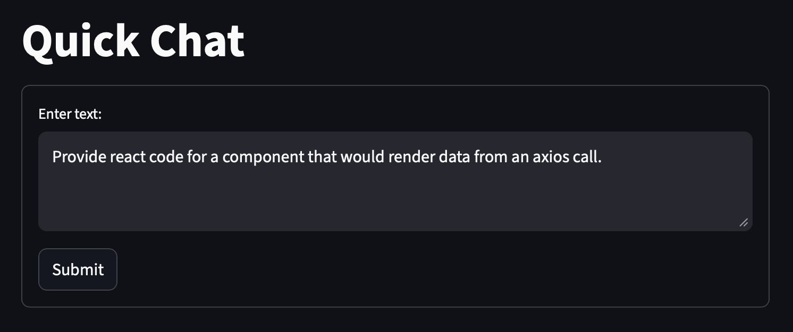

## Setup

```
uv init
source venv/bin/activate
uv add -r requirements.txt
```

## Interface
Provides an interface utilizing streamlit and langchain to access a locally run ollama version and a locally stored llm model.

## Screenshot

 
